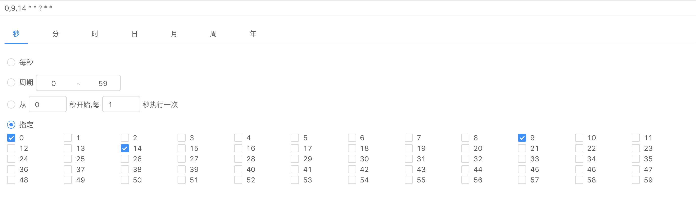

# cron-editor



## usage

- npm install antd-cron-editor

```jsx
import React from 'react';
import CronEditor from 'antd-cron-editor';

const Test = () => {
  const handleChange = (cronText) => {
    console.log(cronText);
  };

  return <CronEditor onChange={handleChange} />;
};

export default Test;

```

